# MFU-DEVOPS-02: CI/CD Pipeline Improvement and Code Quality Enforcement

## 📋 **Overview**

**Status**: In Progress  
**Priority**: High  
**Effort**: Medium (2-3 days)  
**Dependencies**: None  
**Related MFUs**: MFU-WP00-01, MFU-WP00-05  

### **Problem Statement**

The current CI/CD pipeline is experiencing multiple critical failures that prevent successful builds and deployments:

1. **ESLint Configuration Corruption**: Merge conflict markers in `.eslintrc.js` causing syntax errors
2. **ES Module Compliance Violations**: Extensive use of CommonJS `require()` statements throughout the codebase
3. **Code Quality Issues**: 43 linting problems including unused variables, parsing errors, and syntax violations
4. **Inconsistent Module Systems**: Mixed CommonJS/ES module usage causing runtime and build failures

### **Business Impact**

- **Development Velocity**: CI failures block all pull requests and deployments
- **Code Quality**: Accumulated technical debt affecting maintainability
- **Developer Experience**: Frustrating development workflow with frequent CI failures
- **Release Risk**: Inability to deploy stable releases due to pipeline failures

---

## 🏗️ **Architecture**

### **Current State Analysis**

```mermaid
graph TD
    A[GitHub Actions CI] --> B[Node.js Lint Job]
    A --> C[Python Lint Job]
    A --> D[Harness Test Job]
    
    B --> E[ESLint Configuration]
    B --> F[ES Module Check]
    B --> G[Code Quality Check]
    
    E --> H[❌ Merge Conflicts]
    F --> I[❌ require() Statements]
    G --> J[❌ 43 Linting Issues]
    
    H --> K[Build Failure]
    I --> K
    J --> K
```

### **Target State Architecture**

```mermaid
graph TD
    A[GitHub Actions CI] --> B[Node.js Lint Job]
    A --> C[Python Lint Job]
    A --> D[Harness Test Job]
    
    B --> E[✅ Clean ESLint Config]
    B --> F[✅ ES Module Compliance]
    B --> G[✅ Zero Linting Issues]
    
    E --> H[Build Success]
    F --> H
    G --> H
    
    H --> I[Deployment Ready]
```



### **Component Architecture**

#### **1. ESLint Configuration Layer**

- **File**: `.eslintrc.js`
- **Purpose**: Centralized linting rules and configuration
- **Features**: ES module support, TypeScript integration, custom rules

#### **2. ES Module Compliance Layer**

- **Script**: `scripts/check-es-modules.sh`
- **Purpose**: Automated detection of CommonJS patterns
- **Features**: require() detection, module.exports detection, import validation

#### **3. Code Quality Enforcement Layer**

- **Tools**: ESLint, Prettier, TypeScript compiler
- **Purpose**: Automated code quality checks
- **Features**: Unused variable detection, syntax validation, formatting

#### **4. CI/CD Integration Layer**

- **File**: `.github/workflows/ci.yml`
- **Purpose**: Automated pipeline execution
- **Features**: Parallel job execution, artifact collection, failure reporting

---

## 🖥️ **CLI Interface**

### **Development Commands**

```bash
# Environment setup and validation
bash scripts/validate-dev-env.sh    # Validate development environment
npm run setup                       # Install all dependencies
npx husky install                   # Set up Git hooks

# Code quality checks
npm run lint                        # Run ESLint on all files
npm run lint:fix                    # Auto-fix ESLint issues
npm run check-es-modules            # Verify ES module compliance
npm run format                      # Format code with Prettier

# Testing and validation
npm test                            # Run all tests
npm run harness                     # Run integration tests
npm run build                       # Build TypeScript projects

# CI/CD simulation
npm run ci:simulate                 # Simulate full CI pipeline locally
npm run ci:validate                 # Validate CI configuration

# Git workflow with CI/CD integration
./scripts/dev-tools/git-workflow.sh mfu-commit      # Commit with CI/CD validation
./scripts/dev-tools/git-workflow.sh validate        # Run all validations
./scripts/dev-tools/git-workflow.sh mfu-fast-commit # Fast commit (skip validation)
```

### **CI/CD Commands**

```bash
# GitHub Actions workflow steps
- name: Install dependencies
  run: npm ci

- name: Lint code
  run: npm run lint

- name: Check ES modules
  run: npm run check-es-modules

- name: Run tests
  run: npm test

- name: Build projects
  run: npm run build
```

---

## 📊 **Golden Schema**

### **ESLint Configuration Schema**

```json
{
  "$schema": "http://json.schema.org/draft-07/schema#",
  "type": "object",
  "properties": {
    "env": {
      "type": "object",
      "properties": {
        "node": { "type": "boolean" },
        "es2022": { "type": "boolean" }
      }
    },
    "extends": {
      "type": "array",
      "items": { "type": "string" }
    },
    "parserOptions": {
      "type": "object",
      "properties": {
        "ecmaVersion": { "type": "number" },
        "sourceType": { "enum": ["module", "script"] }
      }
    },
    "rules": {
      "type": "object",
      "patternProperties": {
        "^[a-z-]+$": {
          "oneOf": [
            { "type": "string", "enum": ["off", "warn", "error"] },
            { "type": "array", "items": [{ "type": "string" }, { "type": "object" }] }
          ]
        }
      }
    }
  },
  "required": ["env", "extends", "parserOptions", "rules"]
}
```

### **Package.json ES Module Schema**

```json
{
  "$schema": "http://json.schema.org/draft-07/schema#",
  "type": "object",
  "properties": {
    "type": {
      "type": "string",
      "enum": ["module", "commonjs"]
    },
    "scripts": {
      "type": "object",
      "patternProperties": {
        "^[a-z-]+$": { "type": "string" }
      }
    }
  },
  "required": ["type", "scripts"]
}
```

### **CI/CD Pipeline Schema**

```json
{
  "$schema": "http://json.schema.org/draft-07/schema#",
  "type": "object",
  "properties": {
    "name": { "type": "string" },
    "on": {
      "type": "object",
      "properties": {
        "pull_request": { "type": "object" },
        "push": {
          "type": "object",
          "properties": {
            "branches": {
              "type": "array",
              "items": { "type": "string" }
            }
          }
        }
      }
    },
    "jobs": {
      "type": "object",
      "patternProperties": {
        "^[a-z-]+$": {
          "type": "object",
          "properties": {
            "runs-on": { "type": "string" },
            "steps": {
              "type": "array",
              "items": {
                "type": "object",
                "properties": {
                  "name": { "type": "string" },
                  "run": { "type": "string" }
                }
              }
            }
          }
        }
      }
    }
  },
  "required": ["name", "on", "jobs"]
}
```

---

## ✅ **Acceptance Criteria**

### **Critical Requirements (Must Have)**

0. **Local Development Environment**
   - [ ] Cursor IDE configured with required extensions
   - [ ] Platform-specific setup completed (Windows/Mac/Linux)
   - [ ] All project dependencies installed and validated
   - [ ] Git workflow script enhanced with CI/CD checks
   - [ ] Pre-commit hooks configured with Husky
   - [ ] Developer environment validation script working

1. **ESLint Configuration**
   - [ ] Remove all merge conflict markers from `.eslintrc.js`
   - [ ] ESLint runs without syntax errors
   - [ ] Configuration supports ES modules and TypeScript
   - [ ] All linting rules are properly configured

2. **ES Module Compliance**
   - [ ] Zero `require()` statements in JavaScript files
   - [ ] Zero `module.exports` statements in JavaScript files
   - [ ] All `package.json` files have `"type": "module"`
   - [ ] All relative imports include `.js` extensions

3. **Code Quality**
   - [ ] Zero ESLint errors (currently 2 errors)
   - [ ] All ESLint warnings addressed (currently 41 warnings)
   - [ ] No unused variables or imports
   - [ ] No parsing errors in any JavaScript files

4. **CI/CD Pipeline**
   - [ ] All GitHub Actions jobs pass successfully
   - [ ] Lint job completes without errors
   - [ ] ES module check passes
   - [ ] Harness tests execute successfully

### **Important Requirements (Should Have)**

1. **Developer Experience**
   - [ ] Clear error messages for CI failures
   - [ ] Automated fixes for common issues
   - [ ] Consistent formatting across all files
   - [ ] Fast CI pipeline execution (< 5 minutes)

2. **Documentation**
   - [ ] Updated contributing guidelines
   - [ ] ES module migration guide
   - [ ] CI/CD troubleshooting guide
   - [ ] Code quality standards documentation

### **Nice to Have Requirements**

1. **Advanced Features**
   - [ ] Pre-commit hooks for code quality
   - [ ] Automated dependency updates
   - [ ] Performance monitoring in CI
   - [ ] Security scanning integration

---

## 🔗 **Dependencies**

### **Internal Dependencies**

| Component | Dependency | Impact | Status |
|-----------|------------|---------|---------|
| ESLint Config | Merge conflict resolution | Critical | Blocking |
| ES Module Migration | All JavaScript files | High | In Progress |
| Code Quality Fixes | Linting rule compliance | High | Pending |
| CI Pipeline | GitHub Actions workflow | Medium | Working |

### **External Dependencies**

| Tool | Version | Purpose | Status |
|------|---------|---------|---------|
| ESLint | ^8.0.0 | Code linting | Installed |
| Prettier | Latest | Code formatting | Missing |
| TypeScript | ^5.0.0 | Type checking | Installed |
| Node.js | >=18.0.0 | Runtime environment | Installed |

### **Related MFUs**

- **MFU-WP00-01**: IAC Platform Bootstrap and CI - Provides base CI infrastructure
- **MFU-WP00-05**: Test Harness and Golden Samples - Depends on working CI pipeline
- **MFU-WP01-01**: Backend Service Implementation - Requires clean codebase

---

## 🚀 **Execution Guide**

### **Phase 0: Local Development Setup (Day 0)**

#### **Step 0.1: Cursor IDE Configuration**

**Required Extensions:**

```json
{
  "recommendations": [
    "dbaeumer.vscode-eslint",
    "esbenp.prettier-vscode",
    "ms-vscode.vscode-typescript-next",
    "bradlc.vscode-tailwindcss",
    "ms-vscode.vscode-json",
    "redhat.vscode-yaml",
    "ms-vscode.powershell",
    "ms-vscode.vscode-markdown",
    "yzhang.markdown-all-in-one",
    "davidanson.vscode-markdownlint",
    "ms-vscode.vscode-github-actions"
  ]
}
```

**Cursor Settings Configuration:**

```json
{
  "editor.formatOnSave": true,
  "editor.codeActionsOnSave": {
    "source.fixAll.eslint": "explicit",
    "source.organizeImports": "explicit"
  },
  "eslint.validate": [
    "javascript",
    "typescript",
    "json",
    "markdown"
  ],
  "eslint.workingDirectories": [
    ".",
    "backend"
  ],
  "prettier.requireConfig": true,
  "typescript.preferences.importModuleSpecifier": "relative",
  "files.associations": {
    "*.cjs": "javascript",
    "*.mjs": "javascript"
  }
}
```

**Workspace Configuration (`.vscode/settings.json`):**

```json
{
  "eslint.workingDirectories": [
    ".",
    "backend"
  ],
  "eslint.options": {
    "configFile": ".eslintrc.js"
  },
  "prettier.configPath": ".prettierrc",
  "editor.rulers": [80, 120],
  "editor.tabSize": 2,
  "editor.insertSpaces": true,
  "files.eol": "\n",
  "files.trimTrailingWhitespace": true,
  "files.insertFinalNewline": true
}
```

#### **Step 0.2: Platform-Specific Setup**

**Windows Setup:**

```powershell
# Install Node.js (if not already installed)
winget install OpenJS.NodeJS

# Install Git (if not already installed)
winget install Git.Git

# Install PowerShell 7 (recommended)
winget install Microsoft.PowerShell

# Set up Git Bash for script execution
# Add to PATH: C:\Program Files\Git\bin

# Install Windows-specific tools
npm install -g windows-build-tools
```

**macOS Setup:**

```bash
# Install Homebrew (if not already installed)
/bin/bash -c "$(curl -fsSL https://raw.githubusercontent.com/Homebrew/install/HEAD/install.sh)"

# Install Node.js
brew install node

# Install Git (if not already installed)
brew install git

# Install additional tools
brew install bash
```

**Linux Setup:**

```bash
# Ubuntu/Debian
sudo apt update
sudo apt install nodejs npm git

# CentOS/RHEL
sudo yum install nodejs npm git

# Arch Linux
sudo pacman -S nodejs npm git
```

#### **Step 0.3: Project Dependencies Setup**

**Root Project Setup:**

```bash
# Install root dependencies
npm install

# Install global tools
npm install -g eslint prettier markdownlint-cli2

# Verify installations
node --version
npm --version
eslint --version
prettier --version
```

**Backend Project Setup:**

```bash
# Navigate to backend directory
cd backend

# Install backend dependencies
npm install

# Build TypeScript
npm run build

# Return to root
cd ..
```

#### **Step 0.4: Git Workflow Integration**

**Update Git Workflow Script:**

```bash
# Make script executable
chmod +x scripts/dev-tools/git-workflow.sh

# Test the script
./scripts/dev-tools/git-workflow.sh help
```

**Enhanced Git Workflow with CI/CD Checks:**

```bash
# Add to scripts/dev-tools/git-workflow.sh

# New function: pre-commit CI/CD validation
pre_commit_cicd_validation() {
  echo -e "${BLUE}Running pre-commit CI/CD validation...${NC}"
  local ok=true
  
  # ESLint check
  echo "🔍 Running ESLint..."
  if npm run lint; then
    echo -e "${GREEN}✅ ESLint passed${NC}"
  else
    echo -e "${RED}❌ ESLint failed${NC}"
    ok=false
  fi
  
  # ES Module compliance check
  echo "🔍 Checking ES module compliance..."
  if npm run check-es-modules; then
    echo -e "${GREEN}✅ ES module compliance passed${NC}"
  else
    echo -e "${RED}❌ ES module compliance failed${NC}"
    ok=false
  fi
  
  # TypeScript compilation check
  echo "🔍 Checking TypeScript compilation..."
  if cd backend && npm run build; then
    echo -e "${GREEN}✅ TypeScript compilation passed${NC}"
    cd ..
  else
    echo -e "${RED}❌ TypeScript compilation failed${NC}"
    cd ..
    ok=false
  fi
  
  # Code formatting check
  echo "🔍 Checking code formatting..."
  if npx prettier --check .; then
    echo -e "${GREEN}✅ Code formatting passed${NC}"
  else
    echo -e "${YELLOW}⚠️  Code formatting issues found${NC}"
    echo -e "${YELLOW}   Run 'npm run format' to fix${NC}"
  fi
  
  if [[ "$ok" == true ]]; then
    echo -e "${GREEN}✅ All CI/CD validations passed${NC}"
    return 0
  else
    echo -e "${RED}❌ CI/CD validations failed${NC}"
    echo -e "${YELLOW}   Fix issues before committing${NC}"
    return 1
  fi
}

# Update commit functions to include CI/CD validation
commit_mfu_progress() {
  # ... existing code ...
  
  # Add CI/CD validation before commit
  if ! pre_commit_cicd_validation; then
    echo -e "${RED}❌ Pre-commit validation failed. Commit aborted.${NC}"
    return 1
  fi
  
  # ... rest of existing code ...
}
```

#### **Step 0.5: Pre-commit Hooks Setup**

**Install Husky for Git Hooks:**

```bash
# Install Husky
npm install --save-dev husky

# Initialize Husky
npx husky install

# Add pre-commit hook
npx husky add .husky/pre-commit "npm run lint && npm run check-es-modules"

# Add pre-push hook
npx husky add .husky/pre-push "npm test"
```

**Pre-commit Hook Script (`.husky/pre-commit`):**

```bash
#!/usr/bin/env sh
. "$(dirname -- "$0")/_/husky.sh"

echo "🔍 Running pre-commit checks..."

# ESLint check
echo "Running ESLint..."
npm run lint
if [ $? -ne 0 ]; then
  echo "❌ ESLint failed. Please fix errors before committing."
  exit 1
fi

# ES Module compliance check
echo "Checking ES module compliance..."
npm run check-es-modules
if [ $? -ne 0 ]; then
  echo "❌ ES module compliance failed. Please fix issues before committing."
  exit 1
fi

# Code formatting check
echo "Checking code formatting..."
npx prettier --check .
if [ $? -ne 0 ]; then
  echo "⚠️  Code formatting issues found. Run 'npm run format' to fix."
  # Don't fail commit for formatting issues, just warn
fi

echo "✅ Pre-commit checks passed"
```

#### **Step 0.6: Developer Environment Validation**

**Validation Script (`scripts/validate-dev-env.sh`):**

```bash
#!/bin/bash

# Developer Environment Validation Script
# Ensures consistent setup across all development machines

set -e

echo "🔍 Validating developer environment..."

# Colors for output
RED='\033[0;31m'
GREEN='\033[0;32m'
YELLOW='\033[1;33m'
BLUE='\033[0;34m'
NC='\033[0m' # No Color

# Check Node.js version
echo -e "${BLUE}Checking Node.js version...${NC}"
NODE_VERSION=$(node --version)
REQUIRED_NODE_VERSION="v18.0.0"
if [[ "$NODE_VERSION" < "$REQUIRED_NODE_VERSION" ]]; then
  echo -e "${RED}❌ Node.js version $NODE_VERSION is below required $REQUIRED_NODE_VERSION${NC}"
  exit 1
else
  echo -e "${GREEN}✅ Node.js version: $NODE_VERSION${NC}"
fi

# Check npm version
echo -e "${BLUE}Checking npm version...${NC}"
NPM_VERSION=$(npm --version)
echo -e "${GREEN}✅ npm version: $NPM_VERSION${NC}"

# Check required global packages
echo -e "${BLUE}Checking required global packages...${NC}"
REQUIRED_PACKAGES=("eslint" "prettier" "markdownlint-cli2")
for package in "${REQUIRED_PACKAGES[@]}"; do
  if npm list -g "$package" > /dev/null 2>&1; then
    echo -e "${GREEN}✅ $package is installed${NC}"
  else
    echo -e "${RED}❌ $package is not installed globally${NC}"
    echo -e "${YELLOW}   Run: npm install -g $package${NC}"
    exit 1
  fi
done

# Check project dependencies
echo -e "${BLUE}Checking project dependencies...${NC}"
if [ -f "package.json" ]; then
  if npm ci > /dev/null 2>&1; then
    echo -e "${GREEN}✅ Root dependencies installed${NC}"
  else
    echo -e "${RED}❌ Root dependencies installation failed${NC}"
    exit 1
  fi
else
  echo -e "${RED}❌ package.json not found${NC}"
  exit 1
fi

# Check backend dependencies
if [ -d "backend" ] && [ -f "backend/package.json" ]; then
  cd backend
  if npm ci > /dev/null 2>&1; then
    echo -e "${GREEN}✅ Backend dependencies installed${NC}"
  else
    echo -e "${RED}❌ Backend dependencies installation failed${NC}"
    exit 1
  fi
  cd ..
fi

# Check ESLint configuration
echo -e "${BLUE}Checking ESLint configuration...${NC}"
if [ -f ".eslintrc.js" ]; then
  if npx eslint --print-config .eslintrc.js > /dev/null 2>&1; then
    echo -e "${GREEN}✅ ESLint configuration is valid${NC}"
  else
    echo -e "${RED}❌ ESLint configuration is invalid${NC}"
    exit 1
  fi
else
  echo -e "${RED}❌ .eslintrc.js not found${NC}"
  exit 1
fi

# Check Prettier configuration
echo -e "${BLUE}Checking Prettier configuration...${NC}"
if [ -f ".prettierrc" ] || [ -f "prettier.config.js" ]; then
  echo -e "${GREEN}✅ Prettier configuration found${NC}"
else
  echo -e "${YELLOW}⚠️  Prettier configuration not found${NC}"
  echo -e "${YELLOW}   Consider adding .prettierrc file${NC}"
fi

# Check Git hooks
echo -e "${BLUE}Checking Git hooks...${NC}"
if [ -d ".husky" ]; then
  echo -e "${GREEN}✅ Husky Git hooks configured${NC}"
else
  echo -e "${YELLOW}⚠️  Husky Git hooks not configured${NC}"
  echo -e "${YELLOW}   Run: npx husky install${NC}"
fi

# Check Cursor/VS Code extensions
echo -e "${BLUE}Checking recommended extensions...${NC}"
if [ -f ".vscode/extensions.json" ]; then
  echo -e "${GREEN}✅ VS Code extensions configuration found${NC}"
else
  echo -e "${YELLOW}⚠️  VS Code extensions configuration not found${NC}"
  echo -e "${YELLOW}   Consider adding .vscode/extensions.json${NC}"
fi

# Run initial linting check
echo -e "${BLUE}Running initial linting check...${NC}"
if npm run lint > /dev/null 2>&1; then
  echo -e "${GREEN}✅ Initial linting check passed${NC}"
else
  echo -e "${YELLOW}⚠️  Initial linting check found issues${NC}"
  echo -e "${YELLOW}   Run 'npm run lint' to see details${NC}"
fi

# Run ES module compliance check
echo -e "${BLUE}Running ES module compliance check...${NC}"
if npm run check-es-modules > /dev/null 2>&1; then
  echo -e "${GREEN}✅ ES module compliance check passed${NC}"
else
  echo -e "${YELLOW}⚠️  ES module compliance check found issues${NC}"
  echo -e "${YELLOW}   Run 'npm run check-es-modules' to see details${NC}"
fi

echo ""
echo -e "${GREEN}🎉 Developer environment validation completed!${NC}"
echo -e "${BLUE}Your development environment is ready for CI/CD improvements.${NC}"
```

#### **Step 0.7: Documentation Updates**

**Update CONTRIBUTING.md:**

```markdown
## Development Environment Setup

### Prerequisites

1. **Node.js**: Version 18.0.0 or higher
2. **npm**: Latest version
3. **Git**: Latest version
4. **Cursor IDE**: With recommended extensions

### Quick Setup

```bash
# Clone the repository
git clone <repository-url>
cd talk-avocado

# Run environment validation
bash scripts/validate-dev-env.sh

# Install dependencies
npm install
cd backend && npm install && cd ..

# Set up Git hooks
npx husky install
```

### Required Cursor Extensions

Install these extensions in Cursor for optimal development experience:

- ESLint (`dbaeumer.vscode-eslint`)
- Prettier (`esbenp.prettier-vscode`)
- TypeScript (`ms-vscode.vscode-typescript-next`)
- Markdown All in One (`yzhang.markdown-all-in-one`)
- GitHub Actions (`ms-vscode.vscode-github-actions`)

### Pre-commit Checks

The following checks run automatically before each commit:

- ESLint code quality checks
- ES module compliance validation
- Code formatting verification
- TypeScript compilation

### Manual Validation

```bash
# Run all validations
npm run lint
npm run check-es-modules
npm run format

# Validate development environment
bash scripts/validate-dev-env.sh
```

```text

**Update README.md:**
```markdown
## Development Setup

### Prerequisites

- Node.js 18.0.0+
- npm (latest)
- Git (latest)
- Cursor IDE with recommended extensions

### Quick Start

```bash
# Clone and setup
git clone <repository-url>
cd talk-avocado
bash scripts/validate-dev-env.sh

# Install dependencies
npm install
cd backend && npm install && cd ..

# Start development
npm run dev
```

### CI/CD Development

This project uses automated CI/CD checks. Before committing:

```bash
# Run pre-commit checks
npm run lint
npm run check-es-modules
npm run format

# Use Git workflow script
./scripts/dev-tools/git-workflow.sh
```

```text

### **Phase 1: Critical Fixes (Day 1)**

#### **Step 1.1: Fix ESLint Configuration**
```bash
# 1. Remove merge conflict markers
git checkout HEAD -- .eslintrc.js

# 2. Verify configuration
npx eslint --print-config .eslintrc.js

# 3. Test linting
npm run lint
```

#### **Step 1.2: Fix Critical Parsing Errors**

```bash
# 1. Fix SmartCutPlanner duplicate variable
# File: podcast-automation/SmartCutPlanner/index.js:744
# Issue: 'validatedCuts' already declared

# 2. Fix TranscribeWithWhisper await usage
# File: podcast-automation/TranscribeWithWhisper/index.js:290
# Issue: await outside async function
```

#### **Step 1.3: Validate CI Pipeline**

```bash
# 1. Test local CI simulation
npm run ci:simulate

# 2. Verify GitHub Actions workflow
# Check .github/workflows/ci.yml syntax
```

### **Phase 2: ES Module Migration (Day 2)**

#### **Step 2.1: Convert CommonJS to ES Modules**

```bash
# 1. Identify all require() statements
npm run check-es-modules

# 2. Convert podcast-automation files
# - ExtractAudioFromVideo/index.js
# - TranscribeWithWhisper/index.js
# - SmartCutPlanner/index.js
# - VideoRenderEngine/index.js

# 3. Convert harness tools
# - tools/harness/*.js files
```

#### **Step 2.2: Update Package Configurations**

```bash
# 1. Ensure all package.json have "type": "module"
find . -name "package.json" -exec grep -L '"type": "module"' {} \;

# 2. Add missing .js extensions to imports
# Use automated tool or manual conversion
```

### **Phase 3: Code Quality Cleanup (Day 3)**

#### **Step 3.1: Fix Linting Issues**

```bash
# 1. Auto-fix issues where possible
npm run lint:fix

# 2. Manual fixes for remaining issues
# - Remove unused variables
# - Fix prefer-const violations
# - Handle no-empty blocks
```

#### **Step 3.2: Add Prettier Configuration**

```bash
# 1. Install Prettier
npm install --save-dev prettier

# 2. Create .prettierrc configuration
# 3. Add format script to package.json
# 4. Integrate with CI pipeline
```

### **Phase 4: Testing and Validation**

#### **Step 4.1: Comprehensive Testing**

```bash
# 1. Run full test suite
npm test

# 2. Run harness tests
npm run harness

# 3. Simulate CI pipeline
npm run ci:simulate
```

#### **Step 4.2: Documentation Updates**

```bash
# 1. Update CONTRIBUTING.md
# 2. Create ES module migration guide
# 3. Update CI/CD documentation
```

---

## 🧪 **Tests**

### **Unit Tests**

#### **ESLint Configuration Test**

```javascript
// test/eslint-config.test.js
import { ESLint } from 'eslint';

describe('ESLint Configuration', () => {
  test('should load without errors', async () => {
    const eslint = new ESLint();
    const config = await eslint.calculateConfigForFile('test.js');
    expect(config).toBeDefined();
  });

  test('should support ES modules', async () => {
    const eslint = new ESLint();
    const config = await eslint.calculateConfigForFile('test.js');
    expect(config.parserOptions.sourceType).toBe('module');
  });
});
```

#### **ES Module Compliance Test**

```javascript
// test/es-module-compliance.test.js
import { execSync } from 'child_process';

describe('ES Module Compliance', () => {
  test('should have no require() statements', () => {
    const result = execSync('npm run check-es-modules', { encoding: 'utf8' });
    expect(result).toContain('✅ All files are using ES modules!');
  });
});
```

### **Integration Tests**

#### **CI Pipeline Test**

```bash
#!/bin/bash
# test/ci-pipeline.test.sh

set -e

echo "Testing CI pipeline components..."

# Test linting
npm run lint

# Test ES module compliance
npm run check-es-modules

# Test formatting
npm run format

# Test build process
npm run build

echo "✅ All CI pipeline tests passed"
```

#### **Code Quality Test**

```javascript
// test/code-quality.test.js
import { ESLint } from 'eslint';

describe('Code Quality', () => {
  test('should have zero linting errors', async () => {
    const eslint = new ESLint();
    const results = await eslint.lintFiles(['**/*.js', '**/*.ts']);
    
    const errorCount = results.reduce((acc, result) => 
      acc + result.errorCount, 0);
    
    expect(errorCount).toBe(0);
  });

  test('should have minimal warnings', async () => {
    const eslint = new ESLint();
    const results = await eslint.lintFiles(['**/*.js', '**/*.ts']);
    
    const warningCount = results.reduce((acc, result) => 
      acc + result.warningCount, 0);
    
    expect(warningCount).toBeLessThan(10);
  });
});
```

### **End-to-End Tests**

#### **Full CI Simulation Test**

```bash
#!/bin/bash
# test/ci-simulation.test.sh

set -e

echo "Running full CI simulation..."

# Simulate GitHub Actions environment
export CI=true
export GITHUB_ACTIONS=true

# Run all CI steps
npm ci
npm run lint
npm run check-es-modules
npm test
npm run build
npm run harness

echo "✅ Full CI simulation completed successfully"
```

---

## 📈 **Metrics**

### **Development Environment Metrics**

| Metric | Current | Target | Measurement |
|--------|---------|---------|-------------|
| Developer Environment Validation | N/A | 100% | `bash scripts/validate-dev-env.sh` |
| Cursor Extensions Installed | N/A | 100% | Manual verification |
| Pre-commit Hooks Working | N/A | 100% | Git commit test |
| Platform Consistency | N/A | 100% | Cross-platform validation |

### **Code Quality Metrics**

| Metric | Current | Target | Measurement |
|--------|---------|---------|-------------|
| ESLint Errors | 2 | 0 | `npm run lint` |
| ESLint Warnings | 41 | <10 | `npm run lint` |
| require() Statements | 50+ | 0 | `npm run check-es-modules` |
| module.exports Statements | 10+ | 0 | `npm run check-es-modules` |
| Unused Variables | 20+ | 0 | ESLint `no-unused-vars` |
| Parsing Errors | 2 | 0 | ESLint parsing |

### **CI/CD Performance Metrics**

| Metric | Current | Target | Measurement |
|--------|---------|---------|-------------|
| CI Pipeline Duration | N/A | <5 min | GitHub Actions |
| Build Success Rate | 0% | 100% | GitHub Actions |
| Lint Job Duration | N/A | <2 min | GitHub Actions |
| Test Job Duration | N/A | <3 min | GitHub Actions |

### **Developer Experience Metrics**

| Metric | Current | Target | Measurement |
|--------|---------|---------|-------------|
| Local Build Time | N/A | <30 sec | `npm run build` |
| Lint Fix Success Rate | N/A | >90% | `npm run lint:fix` |
| ES Module Check Time | N/A | <10 sec | `npm run check-es-modules` |

### **Monitoring and Alerting**

#### **Success Criteria**

- ✅ Zero ESLint errors
- ✅ <10 ESLint warnings
- ✅ 100% CI pipeline success rate
- ✅ <5 minute CI duration
- ✅ Zero require() statements

#### **Failure Thresholds**

- ❌ >0 ESLint errors
- ❌ >20 ESLint warnings
- ❌ <90% CI success rate
- ❌ >10 minute CI duration
- ❌ >0 require() statements

---

## ⚠️ **Risks**

### **High Risk**

| Risk | Impact | Probability | Mitigation |
|------|---------|-------------|------------|
| **ES Module Breaking Changes** | High | Medium | Comprehensive testing, gradual migration |
| **CI Pipeline Downtime** | High | Low | Parallel development, rollback plan |
| **Code Quality Regression** | Medium | Medium | Automated testing, code reviews |

### **Medium Risk**

| Risk | Impact | Probability | Mitigation |
|------|---------|-------------|------------|
| **Developer Productivity Loss** | Medium | Low | Clear documentation, training |
| **Dependency Conflicts** | Medium | Low | Version pinning, compatibility testing |
| **Performance Degradation** | Low | Medium | Performance monitoring, optimization |

### **Low Risk**

| Risk | Impact | Probability | Mitigation |
|------|---------|-------------|------------|
| **Documentation Gaps** | Low | Medium | Comprehensive documentation updates |
| **Tool Configuration Issues** | Low | Low | Configuration validation, testing |

### **Risk Mitigation Strategies**

#### **1. Gradual Migration Approach**

- Phase-based implementation to minimize disruption
- Parallel development environment for testing
- Rollback procedures for each phase

#### **2. Comprehensive Testing**

- Unit tests for all configuration changes
- Integration tests for CI pipeline
- End-to-end tests for full workflow

#### **3. Documentation and Training**

- Detailed migration guides
- Developer training sessions
- Troubleshooting documentation

#### **4. Monitoring and Alerting**

- Real-time CI pipeline monitoring
- Automated quality metrics tracking
- Immediate notification of failures

---

## 🔄 **Related MFUs**

### **Dependencies**

- **MFU-WP00-01**: IAC Platform Bootstrap and CI
  - **Relationship**: Provides base CI infrastructure
  - **Impact**: This MFU builds upon the CI foundation
  - **Status**: Completed

- **MFU-WP00-05**: Test Harness and Golden Samples
  - **Relationship**: Depends on working CI pipeline
  - **Impact**: This MFU enables the test harness to function
  - **Status**: In Progress

### **Dependents**

- **MFU-WP01-01**: Backend Service Implementation
  - **Relationship**: Requires clean, linted codebase
  - **Impact**: This MFU enables backend development
  - **Status**: Pending

- **MFU-WP01-02**: API Gateway Integration
  - **Relationship**: Requires working CI/CD pipeline
  - **Impact**: This MFU enables API deployment
  - **Status**: Pending

### **Related Work**

- **Code Quality Standards**: Establishing consistent coding practices
- **Developer Experience**: Improving development workflow
- **Release Management**: Enabling reliable deployments
- **Technical Debt Reduction**: Cleaning up accumulated issues

---

## 📝 **Implementation Notes**

### **Key Decisions**

1. **ES Module Migration Strategy**
   - Decision: Convert all CommonJS to ES modules
   - Rationale: Modern JavaScript standard, better tree-shaking, improved performance
   - Impact: Requires updating all JavaScript files

2. **ESLint Configuration Approach**
   - Decision: Use single `.eslintrc.js` with ES module support
   - Rationale: Centralized configuration, consistent rules across project
   - Impact: Requires removing merge conflicts and updating rules

3. **CI Pipeline Structure**
   - Decision: Maintain parallel jobs (Node, Python, Harness)
   - Rationale: Faster execution, independent failure handling
   - Impact: Requires fixing all job dependencies

### **Technical Considerations**

1. **Backward Compatibility**
   - Some tools may not support ES modules
   - May need `.cjs` files for CommonJS-only tools
   - Gradual migration approach to minimize disruption

2. **Performance Optimization**
   - ES modules enable better tree-shaking
   - Faster CI execution with parallel jobs
   - Caching strategies for dependencies

3. **Developer Experience**
   - Clear error messages for CI failures
   - Automated fixes where possible
   - Comprehensive documentation

### **Future Enhancements**

1. **Pre-commit Hooks**
   - Automatic linting before commits
   - ES module compliance checking
   - Code formatting enforcement

2. **Advanced CI Features**
   - Dependency vulnerability scanning
   - Performance regression testing
   - Automated dependency updates

3. **Monitoring and Observability**
   - CI pipeline performance metrics
   - Code quality trend analysis
   - Developer productivity metrics

---

## 🎯 **Success Criteria**

### **Immediate Success (End of Implementation)**

- [ ] Local development environment fully configured
- [ ] All developers have consistent setup across platforms
- [ ] Pre-commit hooks preventing CI/CD issues
- [ ] Zero ESLint errors in CI pipeline
- [ ] All GitHub Actions jobs passing
- [ ] ES module compliance achieved
- [ ] Code quality issues resolved

### **Short-term Success (1-2 weeks)**

- [ ] Stable CI pipeline with 100% success rate
- [ ] Developer productivity improved
- [ ] Code quality metrics within targets
- [ ] Documentation updated and complete

### **Long-term Success (1-3 months)**

- [ ] Reduced technical debt
- [ ] Improved code maintainability
- [ ] Faster development cycles
- [ ] Enhanced developer experience

### **Success Metrics Dashboard**

```bash
# Daily monitoring commands
npm run ci:status          # Check CI pipeline status
npm run quality:report     # Generate code quality report
npm run metrics:summary    # Show key metrics summary
npm run health:check       # Overall system health check
```

---

*This MFU document provides a comprehensive roadmap for resolving all identified CI/CD issues and establishing a robust, maintainable development pipeline.*
